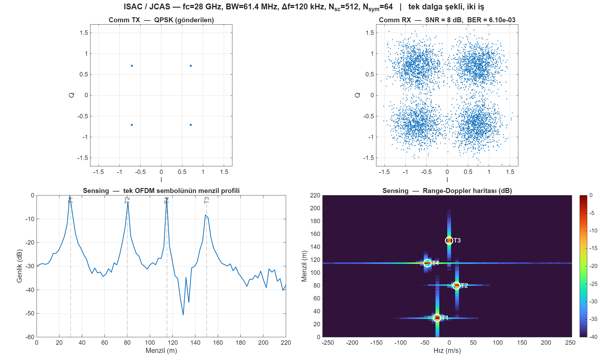
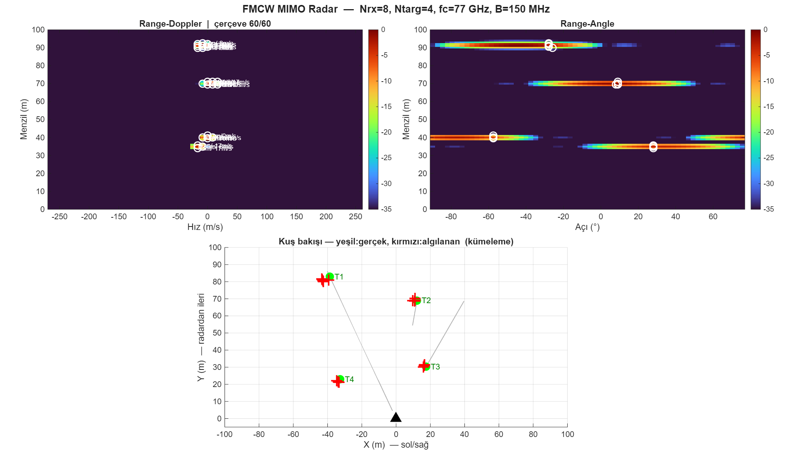
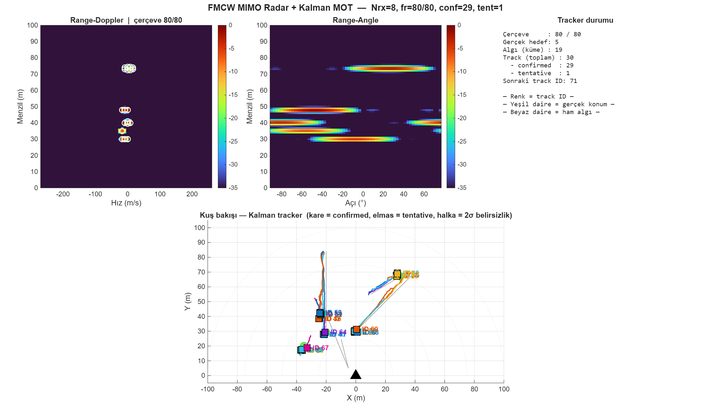

# MATLAB FMCW radar ve ISAC örnekleri

FMCW (77 GHz otomotiv benzeri) radar simülasyonları ve 28 GHz OFDM tabanlı ISAC (Integrated Sensing and Communication) demosu. Tüm betikler **Signal Processing Toolbox** ile çalışır (Phased Array gerekmez).

**GitHub:** https://github.com/Alp2246/matlab-fmcw-isac-examples

## Simülasyon çıktıları (grafikler)

Yeniden üretmek için: `export_all_results`

---

### 1. FMCW Range-Doppler + CA-CFAR
**Betik:** `fmcw_radar_range_doppler_ornek.m`  
**Radar:** fc = 77 GHz, B = 150 MHz, ΔR ≈ 1 m, 3 hedef (menzil/hız farklı)

4 panel: (1) chirp dalga şekli, (2) tek chirp menzil profili, (3) 2B Range-Doppler haritası + gerçek hedefler (beyaz daire), (4) CA-CFAR algılamaları (+ işaretleri). Otomotiv radarında hedef tespiti ve menzil-hız ayrımının temel adımları.

---

### 2. ISAC OFDM — iletişim + algılama
**Betik:** `isac_ofdm_sensing_ornek.m`  
**Sistem:** 28 GHz, 512 alt-taşıyıcı, 64 OFDM sembol, 120 kHz SCS

**Tek dalga şekli** hem QPSK iletişim (BER) hem menzil-Doppler algılama yapar. Sol: iletişim tarafı; sağ: yansıma modeli + 2B FFT ile menzil-Doppler haritası ve gerçek hedef konumları. Sturm & Wiesbeck (2011) ISAC modelinin sade monostatik hali.

---

### 3. FMCW MIMO — açı kestirimi (animasyon son kare)
**Betik:** `fmcw_radar_mimo_animasyon_ornek.m`  
**Dizi:** 8 elemanlı ULA (λ/2), 4 hareketli hedef, 60 çerçeve

Range × Doppler × **Açı** 3B işleme; CFAR + kümeleme ile hedef başına (R, V, θ). Kuş bakışı panelde yeşil = gerçek, kırmızı = algılanan. Açı çözünürlüğü ~14° (Nrx = 8).

---

### 4. Kalman çoklu hedef takibi (MOT)
**Betik:** `fmcw_radar_kalman_tracker_ornek.m`  
**Algoritma:** 4D sabit-hız Kalman, greedy NN ilişkilendirme, M/N track doğrulama

Ölçüm kümesinin üstüne profesyonel takip: kalıcı track ID, geçmiş izi, 2σ elipsi. 80 çerçevenin son hali; 5. hedef 25. çerçevede sahneye girer (doğum senaryosu).

---

| Betik | Konu |
|-------|------|
| `fmcw_radar_range_doppler_ornek.m` | LFM chirp, dechirp, 2B Range-Doppler, CA-CFAR |
| `fmcw_radar_mimo_animasyon_ornek.m` | ULA açı kestirimi, animasyonlu çok hedef, kümeleme |
| `fmcw_radar_kalman_tracker_ornek.m` | Kalman MOT: track ID, gate, M/N doğrulama |
| `isac_ofdm_sensing_ornek.m` | Tek OFDM dalga şekli: QPSK iletişim + menzil-Doppler algılama |

Her betik bağımsızdır; dosyayı açıp **F5** ile çalıştırın.

## Önerilen sıra

1. `fmcw_radar_range_doppler_ornek.m` — temel menzil-Doppler
2. `fmcw_radar_mimo_animasyon_ornek.m` — açı + animasyon
3. `fmcw_radar_kalman_tracker_ornek.m` — takip katmanı
4. `isac_ofdm_sensing_ornek.m` — iletişim + algılama birleşimi

## GitHub'a yükleme (MATLAB → sonuç → push)

| Adım | Ne yapılır |
|------|------------|
| 1 | Betiği MATLAB'te çalıştır |
| 2 | `save_github_figure(gcf, 'fmcw_range_doppler')` |
| 3 | `.\push_to_github.ps1 -Message "Range-Doppler guncellendi"` |

**Repoya giren:** `.m`, `results/*.png`, README  
**Repoya girmeyen:** `.mat`, büyük veri (`.gitignore`)

## İlişkili repolar

- [gnss-spoofing-research](https://github.com/Alp2246/gnss-spoofing-research) — GNSS spoofing tespiti
- [matlab-wireless-comm-examples](https://github.com/Alp2246/matlab-wireless-comm-examples) — 5G / WLAN / BPSK-QPSK örnekleri

## Lisans

Eğitim/araştırma amaçlı örnek betikler. ISAC modeli Sturm & Wiesbeck (2011) makalesine dayalı sadeleştirilmiş simülasyondur.
